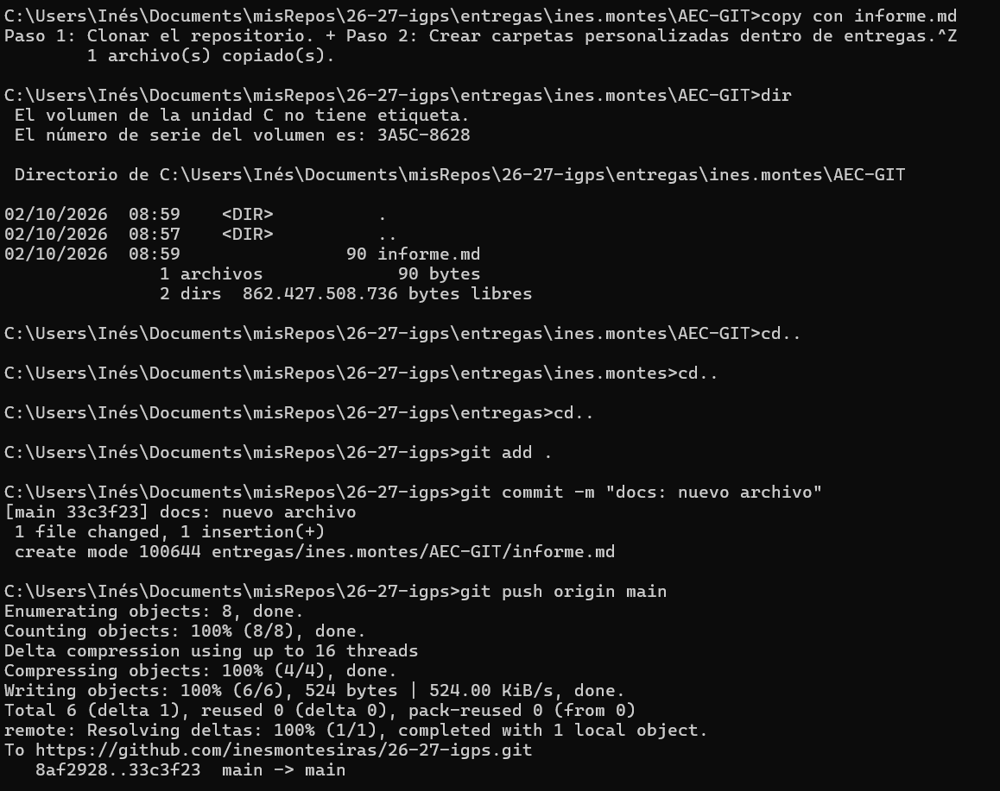

Paso 1: Clonar el repositorio. 

Paso 2: Crear carpetas personalizadas dentro de entregas.

Paso 3: Creación del primer archivo y primer push.

Paso 4: Cambio de rama y modificación del informe con texto y capturas de pantalla.

 
 
 
 
